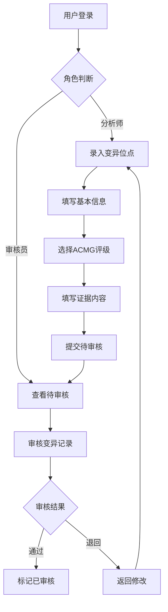

## 1. 产品概述

全外显子测序（WES）变异位点数据库系统，用于集中存储和管理全外显子测序中检测到的变异位点信息、ACMG致病性评级及对应证据内容，帮助遗传分析师和审核人员在遇到相同位点或进行报告审核时快速检索，减少重复分析时间，提升工作效率。

- 目标用户：遗传分析师、报告审核人员、实验室管理员
- 核心价值：避免重复分析、标准化ACMG评级记录、加速报告审核流程

## 2. 核心功能

### 2.1 用户角色

| 角色 | 注册方式 | 核心权限 |
|------|----------|----------|
| 分析师 | 邀请注册/自助注册 | 录入/编辑变异位点、查看/搜索数据库 |
| 审核员 | 管理员分配角色 | 分析师权限 + 审核变异记录、标记审核状态 |
| 管理员 | 系统初始账户 | 全部权限 + 用户管理、系统配置 |

### 2.2 功能模块

1. **登录/注册页**：用户注册、登录、角色管理
2. **仪表盘页**：数据统计概览、最近录入记录、待审核条目
3. **变异位点列表页**：变异位点搜索、筛选、批量操作
4. **变异位点详情/录入页**：位点信息录入/编辑、ACMG评级、证据记录
5. **用户管理页**：用户列表、角色分配、账户状态管理

### 2.3 页面详情

| 页面名称 | 模块名称 | 功能描述 |
|----------|----------|----------|
| 登录/注册页 | 登录表单 | 邮箱+密码登录，记住登录状态 |
| 登录/注册页 | 注册表单 | 邮箱注册，填写姓名、机构信息 |
| 仪表盘页 | 统计卡片 | 总位点数、本月新增、待审核数、各ACMG分类分布 |
| 仪表盘页 | 最近记录 | 最近录入的变异位点列表（前10条） |
| 仪表盘页 | 待审核列表 | 等待审核的变异记录，支持快速跳转 |
| 变异位点列表页 | 搜索栏 | 按基因名、染色体位置、cDNA变异、蛋白变异搜索 |
| 变异位点列表页 | 筛选面板 | 按ACMG分类、基因、录入时间、审核状态筛选 |
| 变异位点列表页 | 数据表格 | 分页展示变异位点，支持排序和批量选择 |
| 变异位点详情页 | 基本信息区 | 染色体、位置、参考碱基、变异碱基、基因、转录本、cDNA、蛋白变异 |
| 变异位点详情页 | ACMG评级区 | 致病性分类（Pathogenic/Likely Pathogenic/VUS/Likely Benign/Benign），各证据项勾选与说明 |
| 变异位点详情页 | 证据详情区 | 28项ACMG证据（PVS1/PS1-4/PM1-6/PP1-5/BA1/BS1-4/BP1-7）的详细记录 |
| 变异位点详情页 | 审核记录区 | 审核意见、审核人、审核时间、审核状态 |
| 变异位点详情页 | 历史记录区 | 变异记录的修改历史 |
| 用户管理页 | 用户列表 | 用户信息表格，支持搜索和筛选 |
| 用户管理页 | 角色管理 | 分配/修改用户角色，启用/禁用账户 |

## 3. 核心流程

### 3.1 变异位点录入流程
用户登录后，点击"新增位点"进入录入页面，填写变异基本信息（染色体、位置、参考/变异碱基、基因、转录本、cDNA变异、蛋白变异等），选择ACMG致病性分类，逐项勾选并填写ACMG证据内容，提交后进入待审核状态。

### 3.2 报告审核流程
审核员在仪表盘或列表页查看待审核记录，进入详情页审核变异信息和ACMG评级，填写审核意见，通过或退回修改。

### 3.3 快速检索流程
用户在列表页通过基因名、染色体位置、cDNA/蛋白变异等关键词搜索，结合ACMG分类和审核状态筛选，快速定位目标变异位点。

## 4. 用户界面设计

### 4.1 设计风格

- **主色调**：深海蓝（#0F2B46）+ 青碧色（#00B4D8）作为强调色，体现科学严谨与专业感
- **辅助色**：浅灰蓝背景（#F0F4F8），白色卡片，暗色文字
- **ACMG分类色标**：致病（红#DC2626）、可能致病（橙#EA580C）、意义不明（黄#CA8A04）、可能良性（蓝#2563EB）、良性（绿#16A34A）
- **按钮风格**：圆角（8px），主按钮填充色，次按钮描边
- **字体**：标题使用 Source Serif 4，正文使用 DM Sans，数据表格使用 JetBrains Mono
- **布局风格**：左侧导航栏 + 右侧内容区，卡片式布局
- **图标**：Lucide图标库，线性风格

### 4.2 页面设计概览

| 页面名称 | 模块名称 | UI元素 |
|----------|----------|--------|
| 登录/注册页 | 登录/注册表单 | 居中卡片，深海蓝渐变背景，表单输入框带图标，主按钮青碧色 |
| 仪表盘页 | 统计卡片 | 4个统计卡片横排，数字大字体+标签小字体，带图标 |
| 仪表盘页 | 最近记录/待审核 | 白色卡片内表格，行hover高亮，状态标签彩色胶囊 |
| 变异位点列表页 | 搜索与筛选 | 顶部搜索栏+可展开筛选面板，筛选标签式交互 |
| 变异位点列表页 | 数据表格 | 条纹表格，ACMG分类彩色标签，分页器 |
| 变异位点详情页 | 基本信息区 | 网格布局展示字段，标签-值对齐 |
| 变异位点详情页 | ACMG评级区 | 五级分类选择器（彩色按钮组），证据矩阵表格 |
| 变异位点详情页 | 证据详情区 | 可折叠卡片，每项证据含勾选框+文本域 |
| 用户管理页 | 用户列表 | 标准表格，角色下拉选择，状态开关 |

### 4.3 响应式设计

- 桌面优先设计，最小支持1280px宽度
- 平板端（768-1280px）导航栏折叠为图标模式
- 移动端（<768px）导航栏变为底部标签栏，表格改为卡片列表
