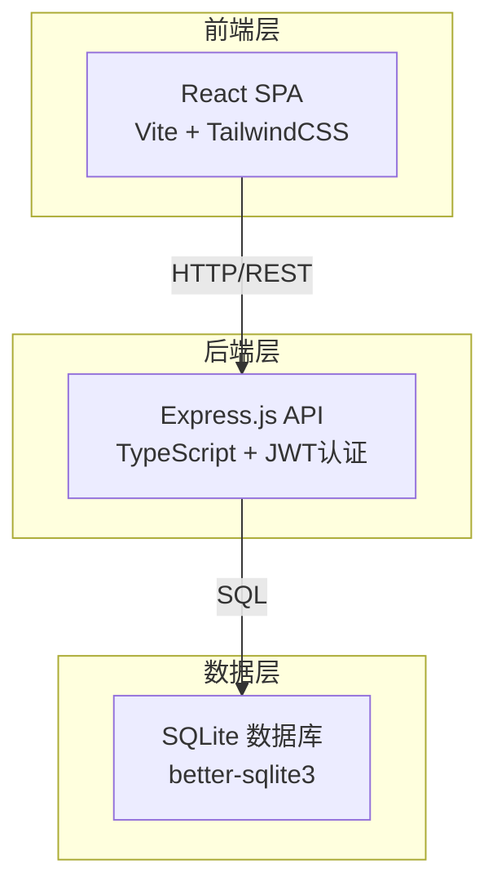
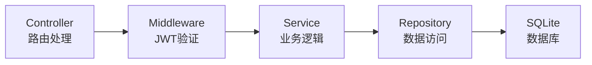
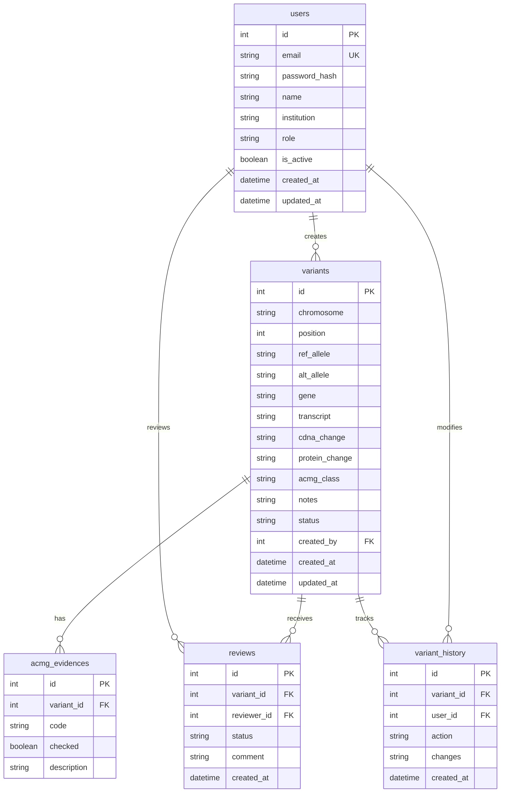

## 1. 架构设计



## 2. 技术说明

- **前端**：React@18 + TailwindCSS@3 + Vite + Zustand（状态管理）
- **初始化工具**：vite-init（react-express-ts模板）
- **后端**：Express@4 + TypeScript（ESM格式）
- **数据库**：SQLite（better-sqlite3），轻量级无需额外部署
- **认证**：JWT（jsonwebtoken）+ bcryptjs 密码加密
- **包管理器**：npm

## 3. 路由定义

| 路由 | 用途 |
|------|------|
| `/login` | 用户登录页 |
| `/register` | 用户注册页 |
| `/dashboard` | 仪表盘首页，数据统计概览 |
| `/variants` | 变异位点列表页，搜索筛选 |
| `/variants/new` | 新增变异位点 |
| `/variants/:id` | 变异位点详情/编辑 |
| `/users` | 用户管理页（管理员） |

## 4. API定义

### 4.1 认证相关

```typescript
// POST /api/auth/register
interface RegisterRequest {
  email: string;
  password: string;
  name: string;
  institution?: string;
}
interface RegisterResponse {
  user: { id: number; email: string; name: string; role: string };
  token: string;
}

// POST /api/auth/login
interface LoginRequest {
  email: string;
  password: string;
}
interface LoginResponse {
  user: { id: number; email: string; name: string; role: string };
  token: string;
}

// GET /api/auth/me
interface MeResponse {
  id: number; email: string; name: string; role: string; institution?: string;
}
```

### 4.2 变异位点相关

```typescript
// GET /api/variants?page=1&pageSize=20&gene=&acmgClass=&status=&search=
interface VariantListResponse {
  total: number;
  page: number;
  pageSize: number;
  data: Variant[];
}

// GET /api/variants/:id
interface VariantDetailResponse extends Variant {
  evidences: ACMGEvidence[];
  reviews: Review[];
  history: HistoryRecord[];
}

// POST /api/variants
interface CreateVariantRequest {
  chromosome: string;
  position: number;
  refAllele: string;
  altAllele: string;
  gene: string;
  transcript: string;
  cdnaChange: string;
  proteinChange: string;
  acmgClass: 'Pathogenic' | 'Likely Pathogenic' | 'VUS' | 'Likely Benign' | 'Benign';
  evidences: EvidenceInput[];
  notes?: string;
}

// PUT /api/variants/:id
interface UpdateVariantRequest extends Partial<CreateVariantRequest> {}

// DELETE /api/variants/:id

interface Variant {
  id: number;
  chromosome: string;
  position: number;
  refAllele: string;
  altAllele: string;
  gene: string;
  transcript: string;
  cdnaChange: string;
  proteinChange: string;
  acmgClass: string;
  notes?: string;
  status: 'pending' | 'approved' | 'rejected';
  createdBy: number;
  creatorName: string;
  createdAt: string;
  updatedAt: string;
}

interface EvidenceInput {
  code: string; // e.g. 'PVS1', 'PS1', 'PM2', etc.
  checked: boolean;
  description: string;
}

interface ACMGEvidence {
  id: number;
  variantId: number;
  code: string;
  checked: boolean;
  description: string;
}

interface Review {
  id: number;
  variantId: number;
  reviewerId: number;
  reviewerName: string;
  status: 'approved' | 'rejected';
  comment: string;
  createdAt: string;
}

interface HistoryRecord {
  id: number;
  variantId: number;
  userId: number;
  userName: string;
  action: string;
  changes: string;
  createdAt: string;
}
```

### 4.3 审核相关

```typescript
// POST /api/variants/:id/review
interface ReviewRequest {
  status: 'approved' | 'rejected';
  comment: string;
}
```

### 4.4 用户管理相关

```typescript
// GET /api/users
interface UserListResponse {
  data: User[];
}

// PUT /api/users/:id
interface UpdateUserRequest {
  role?: string;
  isActive?: boolean;
  name?: string;
}

interface User {
  id: number;
  email: string;
  name: string;
  institution?: string;
  role: string;
  isActive: boolean;
  createdAt: string;
}
```

## 5. 服务端架构图



## 6. 数据模型

### 6.1 数据模型定义



### 6.2 数据定义语言

```sql
CREATE TABLE users (
  id INTEGER PRIMARY KEY AUTOINCREMENT,
  email TEXT NOT NULL UNIQUE,
  password_hash TEXT NOT NULL,
  name TEXT NOT NULL,
  institution TEXT,
  role TEXT NOT NULL DEFAULT 'analyst' CHECK(role IN ('admin', 'reviewer', 'analyst')),
  is_active INTEGER NOT NULL DEFAULT 1,
  created_at TEXT NOT NULL DEFAULT (datetime('now')),
  updated_at TEXT NOT NULL DEFAULT (datetime('now'))
);

CREATE TABLE variants (
  id INTEGER PRIMARY KEY AUTOINCREMENT,
  chromosome TEXT NOT NULL,
  position INTEGER NOT NULL,
  ref_allele TEXT NOT NULL,
  alt_allele TEXT NOT NULL,
  gene TEXT NOT NULL,
  transcript TEXT,
  cdna_change TEXT,
  protein_change TEXT,
  acmg_class TEXT NOT NULL CHECK(acmg_class IN ('Pathogenic', 'Likely Pathogenic', 'VUS', 'Likely Benign', 'Benign')),
  notes TEXT,
  status TEXT NOT NULL DEFAULT 'pending' CHECK(status IN ('pending', 'approved', 'rejected')),
  created_by INTEGER NOT NULL REFERENCES users(id),
  created_at TEXT NOT NULL DEFAULT (datetime('now')),
  updated_at TEXT NOT NULL DEFAULT (datetime('now'))
);

CREATE INDEX idx_variants_gene ON variants(gene);
CREATE INDEX idx_variants_chromosome_position ON variants(chromosome, position);
CREATE INDEX idx_variants_acmg_class ON variants(acmg_class);
CREATE INDEX idx_variants_status ON variants(status);
CREATE INDEX idx_variants_cdna ON variants(cdna_change);
CREATE INDEX idx_variants_protein ON variants(protein_change);

CREATE TABLE acmg_evidences (
  id INTEGER PRIMARY KEY AUTOINCREMENT,
  variant_id INTEGER NOT NULL REFERENCES variants(id) ON DELETE CASCADE,
  code TEXT NOT NULL,
  checked INTEGER NOT NULL DEFAULT 0,
  description TEXT,
  UNIQUE(variant_id, code)
);

CREATE TABLE reviews (
  id INTEGER PRIMARY KEY AUTOINCREMENT,
  variant_id INTEGER NOT NULL REFERENCES variants(id) ON DELETE CASCADE,
  reviewer_id INTEGER NOT NULL REFERENCES users(id),
  status TEXT NOT NULL CHECK(status IN ('approved', 'rejected')),
  comment TEXT,
  created_at TEXT NOT NULL DEFAULT (datetime('now'))
);

CREATE TABLE variant_history (
  id INTEGER PRIMARY KEY AUTOINCREMENT,
  variant_id INTEGER NOT NULL REFERENCES variants(id) ON DELETE CASCADE,
  user_id INTEGER NOT NULL REFERENCES users(id),
  action TEXT NOT NULL,
  changes TEXT,
  created_at TEXT NOT NULL DEFAULT (datetime('now'))
);

-- 初始管理员账户 (密码: admin123)
INSERT INTO users (email, password_hash, name, role, is_active)
VALUES ('admin@wes-db.com', '$2a$10$placeholder_hash', '系统管理员', 'admin', 1);
```
